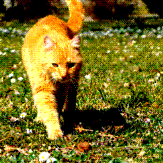
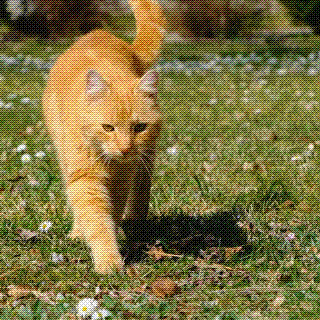
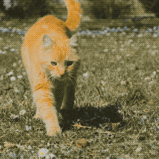
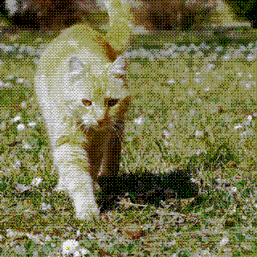
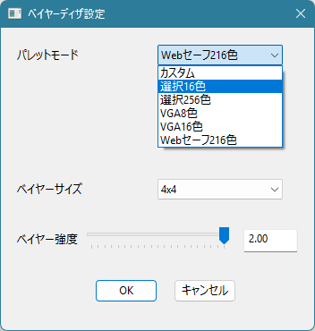

# GIFベイヤーディザ出力プラグイン

減色とベイヤーディザを適用した GIF を出力します。  
画質を犠牲にファイルサイズを削減します。

## 画質、ファイルサイズの比較

解像度: 320x320, 8fps の動画を GIF 出力した結果の比較

### 通常 GIF 出力

- ファイルサイズ: 4.871 MB
- 「yu7400kiさんの[GIF出力プラグイン](https://yu7400ki.me/aviutl2-animated-image-output/)」による出力

### Webセーフ 216色

- ファイルサイズ: 2.533 MB

### 選択16色

- ファイルサイズ: 1.721 MB

### VGA 16色

- ファイルサイズ: 1.211 MB

### VGA 8色

- ファイルサイズ: 0.939 MB

## 設定画面

